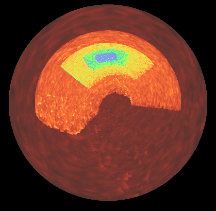

.. highlight:: shell

================================
Non-Cartesian Coordinate Systems
================================

Initial support for volume rendering of data defined in 3D non-cartesian coordinate systems
was added in yt_idv 0.5.0 for block-AMR data in spherical coordinates. While not all
rendering methods and annotations are supported for spherical coordinates, yt_idv can
directly calculate maximum intensity projections, integrative projections and projection with custom
transfer functions without any pre-interpolation or re-gridding.

The approach for handling data defined in non-cartesian coordinates is to pre-calculate cartesian
bounding boxes of the data blocks. The rendering pipeline then uses the cartesian bounding boxes
to calculate ray entry/exit points during ray tracing. Between the entry/exit points, the
cartesian coordinates of the ray position are converted to the native coordinates of the data,
which is used to sample the texture maps (which are stored in native coordinates). The initial
implementaiton of the algorithm uses the ray entry/exit points of the cartesian bounding boxes,
and so not all points along the ray are gaurenteed to lie within the bounds of the data -- though
these data points will be discarded during ray tracing, it does mean that a larger number of samples
along the ray is required to gaurantee the underlying non-cartesian element is properly sampled compared
to the standard cartesian data ray tracing (this is controlled by the ``sample_factor`` attribute of
the ``BlockRendering`` component).

At present, supported non-cartesian coordinate systems include Spherical Coordinates with (r, theta, phi), where r is radius, theta is co-latitude (between 0, pi)
and phi is azimuth (between 0, 2pi), following yt conventions.

----------------------------
Notes on further development
----------------------------

Further contributions are welcome for adding support for the remaining 3d non-cartesian coordinate systems
that yt supports that are not yet supported here (3d cylindrical, 3d geographic) as well as for adding
support for non-cartesian coordinate systems in additional yt_idv components.

To add support for additional non-cartesian coordinate systems requires two steps:

#. Add methods for calcualting cartesian bounding boxes
#. Add support to the rendering pipeline

****************************************************
Add methods for calcualting cartesian bounding boxes
****************************************************

The cartesian bounding box methods are defined in ``yt_idv/coordinate_utilities.pyx``. When adding support
for a new coordiante system, implement a new ``MixedCoordBBox`` child class, following the
``SphericalMixedCoordBBox`` example. The main method is ``get_cartesian_bbox``, which returns the
cartesian bounding box for a single non-cartesian element. Once implemented, ``yt_idv.cartesian_bboxes``
can be used to calculate bounding boxes for arrays of elements.

Next, ``yt_idv.scene_data.block_collection.BlockCollection`` should be updated (mostly in
``add_data`` and ``_set_geometry_attributes``) to handle the new coordinate system following the
example for spherical coordinates.

These two steps will handle the CPU-side of the calculations, next you need to update
the rendering pipeline.

*************************************
Add support to the rendering pipeline
*************************************

A number of changes are requirer related to the rendering pipeline for the ``block_rendering``
shader program. In order to avoid shader code duplication for different coordinate systems and
also avoid overly branching code within the shader itself, pre-processor directives are used
to provide switches between shader behavior for different coordinate systems.

The ``NONCARTESIAN_GEOM`` directive is for functionality that should cover shared behavior
between all non-cartesian coordinate systems. For example, ``grid_position.vert.glsl``,
``grid_expand.geom.glsl`` and ``ray_tracing.frag.glsl`` all use ``NONCARTESIAN_GEOM`` for
passing along the additional vertex attributes related to the cartesian bounding boxes.

Functionality specific to a coordinate system should be defined with a new pre-processor
directive flag. For spherical coordiantes, this is ``SPHERICAL_GEOM``, and is used in
``ray_tracing.frag.glsl`` for defining and using the functions for transforming from
cartesian to spherical coordinates. To add a new one for use in the shaders, add a new
entry to the ``yt_idv.scene_components.base_component._geom_directives`` dictionary and
then wrap any functionality specific to your new coordinate system within pre-processor checks,
for example::

    #ifdef SPHERICAL_GEOM
    vec3 cart_to_sphere_vec3(vec3 v) {
        // transform a single point in cartesian coords to spherical
        vec3 vout = vec3(0.,0.,0.);

        // ---- code trimmed for clarity ---- //

        return vout;

    }
    #endif

When the shader program compiles, the above function will only be defined for rendering
data in spherical coordinates.

At a minimum, you will need to add a function to handle the coordinate conversion from the
cartesian position of the ray to the native coordinates of your data.
